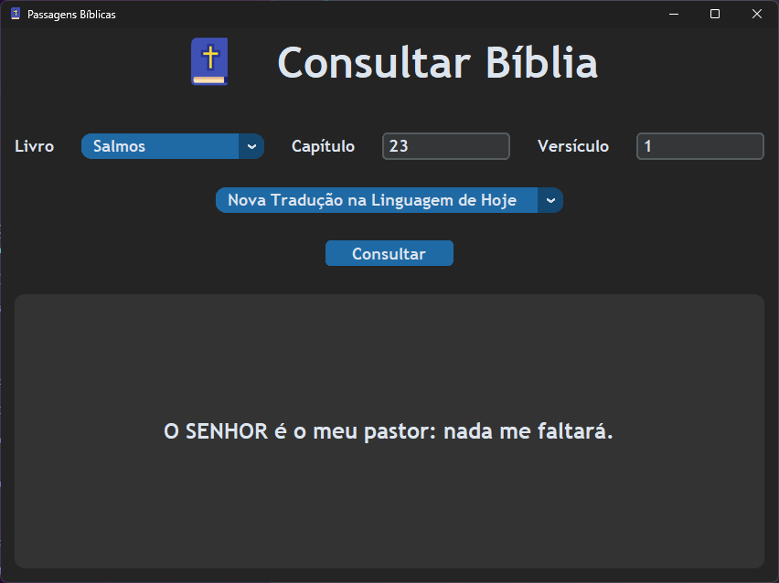

# passagens_biblicas

>## Buscador de passagens bíblicas em bíblias nas seguintes versões:

|Nome|Sigla|
|:-:|:-:|
|_Almeida Corrigida e Fiel_|**ACF**|
|_Almeida Revista e Atualizada_|**ARA**|
|_Almeida Revista e Corrigida_|**ARC**|
|_Almeida Século XXI_|**AS21**|
|_Almeida Atualizada_|**JFAA**|
|_King James Atualizada_|**KJA**|
|_King James Fiel_|**KJF**|
|_Nova Almeida Atualizada_|**NAA**|
|_Nova Bíblia Viva_|**NBV**|
|_Nova Tradução na Linguagem de Hoje_|**NTLH**|
|_Nova Versão Internacional_|**NVI**|
|_Nova Versão Transformadora_|**NVT**|
|_Tradução Brasileira_|**TB**|
 
  

---

>## Bibliografias  

Arquivos da bíblia em SQLite3 →　[aqui](https://altamiro.comunidades.net/biblias)  
Icon by <a href="https://freeicons.io/profile/714">Raj Dev</a> on <a href="https://freeicons.io">freeicons.io</a>